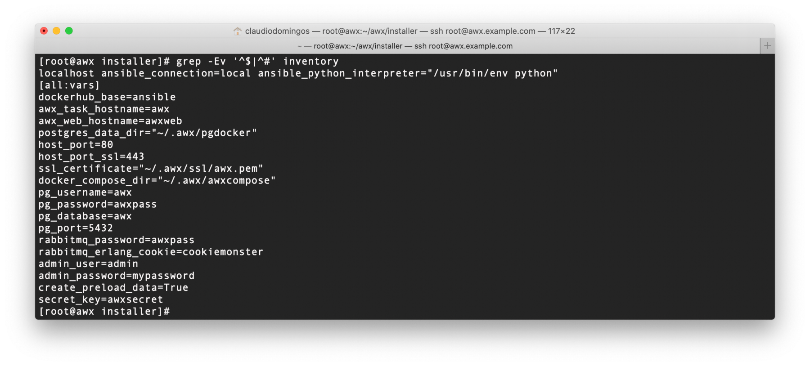
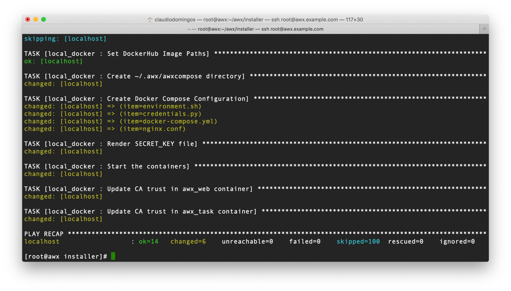
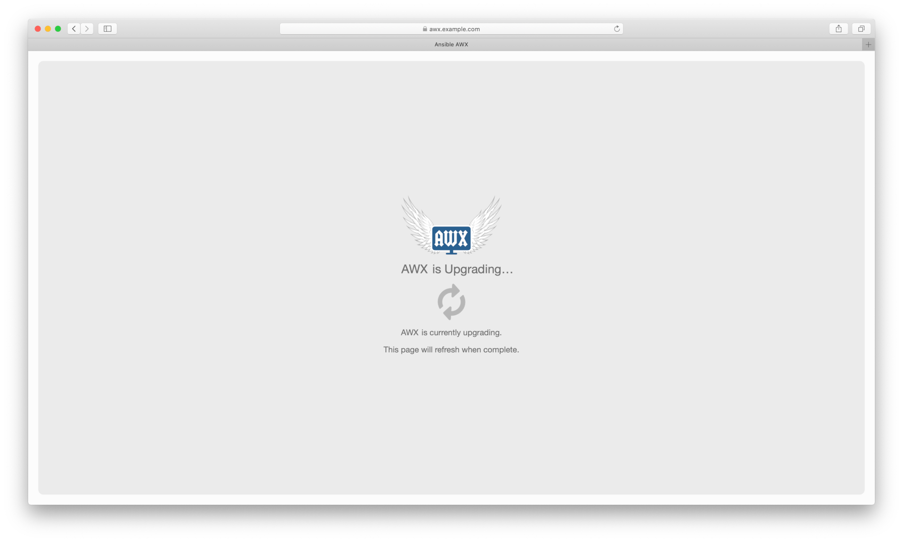
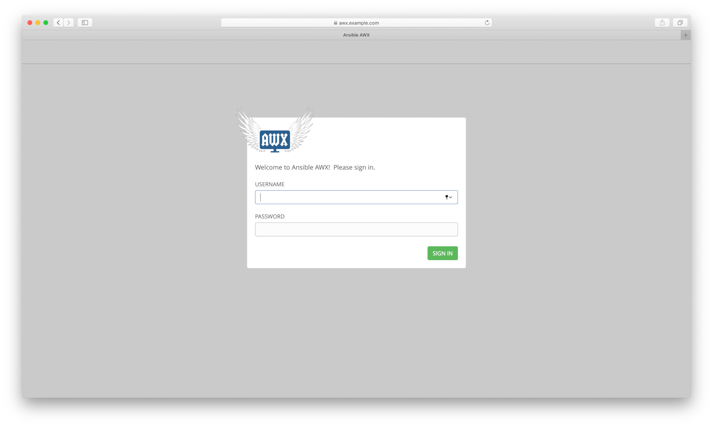
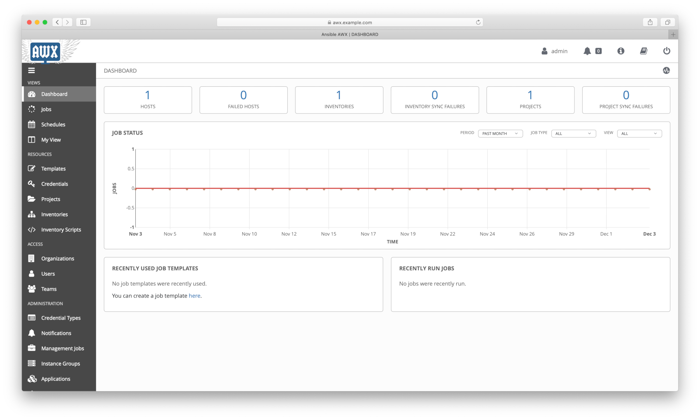

# Ansible AWX Guide: from scratch to REST API (2/8)

## AWX Installation on Docker Compose

This topic is about how to install Ansible AWX on Docker Compose.

Nowadays the most applications are container-based design, Ansible AWX has support to multiple deployment types such as OpenShift, Kubernetes, Minishift, and Docker Compose.

## Table of Contents

- [Concepts](#Concepts)
- [System Requirements](#System-Requirements)
- [Prerequisites](#Prerequisites)
- [Setup Docker](#Setup-Docker)
- [Setup Firewall](#Setup-Firewall)
- [Download and Setup AWX](#Download-and-Setup-AWX)
- [Summary](#Summary)
- [References](#References)

### Concepts

#### What is Docker Compose

>Compose is a tool for defining and running multi-container Docker applications. With Compose, you use a YAML file to configure your application’s services. Then, with a single command, you create and start all the services from your configuration. To learn more about all the features of Compose, see the list of features. <sup>[1]</sup>

### System Requirements

The system requirements for Ansible AWX deployment on Docker Compose. <sup>[2]</sup>

- At least 4GB of memory;
- At least 2 cpu cores;
- At least 20GB of space.

### Prerequisites

Install docker-ce repository.

```shell
curl https://download.docker.com/linux/centos/docker-ce.repo -o /etc/yum.repos.d/docker-ce.repo
```

Install EPEL repository.

```shell
dnf -y install https://dl.fedoraproject.org/pub/epel/epel-release-latest-8.noarch.rpm
```

Install packages.

```shell
dnf -y install python3-pip git docker-ce ansible --nobest
```

Install docker-compose.

```shell
pip3 install docker-compose
```

### Setup Docker

Enable and start docker service.

```shell
systemctl enable --now docker
```

Create a exclusive network for Docker Compose.

```shell
docker network create --opt com.docker.network.bridge.name=awxcompose0 awxcompose
```

### Setup Firewall

Allow the following firewall policies.

```shell
firewall-cmd --zone=trusted --add-interface=awxcompose0 --permanent
firewall-cmd --zone=trusted --add-interface=awxcompose0
firewall-cmd --add-service=http --add-service=https --permanent
firewall-cmd --add-service=http --add-service=https
```

### Download and Setup AWX

Get AWX source code.

```shell
git clone https://github.com/ansible/awx
```

Change directory.

```shell
cd awx/installer/
```

Define Docker Compose network to be used by template.

```shell
cat << EOF >> roles/local_docker/templates/docker-compose.yml.j2

networks:
  default:
    external:
      name: awxcompose
EOF
```

Define AWX admin password.

```shell
sed -E -i 's|^(#)?admin_password=.*|admin_password=mypassword|g' inventory
```

Create SSL certificate.

```shell
mkdir -vp ~/.awx/ssl

openssl req -subj \
  '/C=BR/ST=Sao Paulo/L=Sao Paulo/O=AWX Example/OU=IT/CN=awx.example.com/emailAddress=awx@example.com' \
  -new -nodes -x509 -days 365 -newkey rsa:2048 \
  -keyout ~/.awx/ssl/awx.key \
  -out ~/.awx/ssl/awx.crt

cat ~/.awx/ssl/awx.crt ~/.awx/ssl/awx.key >> ~/.awx/ssl/awx.pem
```

Adjust inventory for SSL certificate.

```shell
sed -E -i 's|^(#)?ssl_certificate=.*|ssl_certificate="~/.awx/ssl/awx.pem"|g' inventory
```

You can adjust other parameters, check inventory file.
By default the user's home directory is the default path for storing container files, as well as for the PostgreSQL database.

```shell
grep -Ev '^$|^#' inventory
```



Run Ansible Playbook to configure AWX.

```shell
ansible-playbook -i inventory -e ansible_python_interpreter=python3 install.yml
```

Wait for playbook to finish.



While containers are initializing, index page remains in status "AWX is Upgrading", that page will be automatically refreshed and redirected to login page, then it will be able to accept user credentials.

NOTE: it's strongly recommended to use Safari or Firefox browsers, recent Chrome version does not work due self-signed certificate.





### Summary

In this topic was presented:

- Installing AWX prerequisites;
- Download and setup Ansible AWX for Docker Compose deployment on CentOS 8.

### References

[1]: <https://docs.docker.com/compose/>
\[1\] - <https://docs.docker.com/compose/>

[2]: <https://github.com/ansible/awx/blob/devel/INSTALL.md>
\[2\] - <https://github.com/ansible/awx/blob/devel/INSTALL.md>

## Continue Reading

Next topic: [Managing AWX using REST API, CLI and Web UI](3_awx_cli.md)

[Go to main page](README.md)

[Go to top](#AWX-Installation-on-Docker-Compose)
