# Ansible AWX Guide: from scratch to REST API (3/8)

## Managing AWX using REST API, CLI and Web UI

First thing you need is to understand AWX REST API to notice their available resources and how to interact with them.

Next, you will use **tower-cli** tool to manage AWX and execute tasks such as create an inventory, add hosts, disable and remove hosts from inventory.

## Table of Contents

- [Concepts](#Concepts)
- [Exploring AWX REST API with cURL](#Exploring-AWX-REST-API-with-cURL)
- [Prerequisites](#Prerequisites)
- [CLI first steps](#CLI-first-steps)
- [Creating a static inventory](#Creating-a-static-inventory)
- [Adding hosts to the static inventory](#Adding-hosts-to-the-static-inventory)
- [Identifying inventory by ID](#Identifying-inventory-by-ID)
- [Identifying host by ID](#Identifying-host-by-ID)
- [Disable host by ID](#Disable-host-by-ID)
- [Delete host by ID](#Delete-host-by-ID)
- [Summary](#Summary)
- [References](#References)

### Concepts

#### What is REST API

>REST stands for Representational State Transfer and is sometimes spelled as “ReST”. It relies on a stateless, client-server, and cacheable communications protocol, usually the HTTP protocol. <sup>[1]</sup>

### Exploring AWX REST API with cURL

Let's explore and understand an interaction example with AWX REST API, this topic is intended to explain, no direct action is required.

First, you need to know which resources are available through API interface.

All resources are detailed described [here](https://docs.ansible.com/ansible-tower/latest/html/towerapi/api_ref.html).

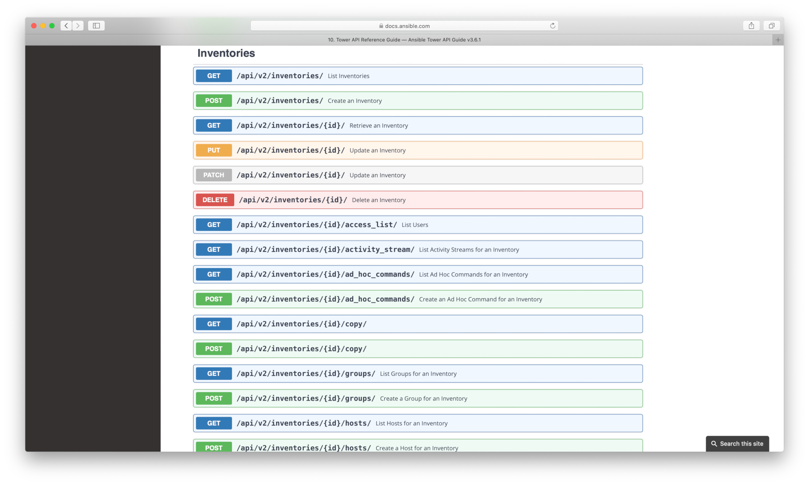

Expand [***Inventories***](https://docs.ansible.com/ansible-tower/latest/html/towerapi/api_ref.html#/Inventories/Inventories_inventories_create) resource.

A practical example is provided from documentation.

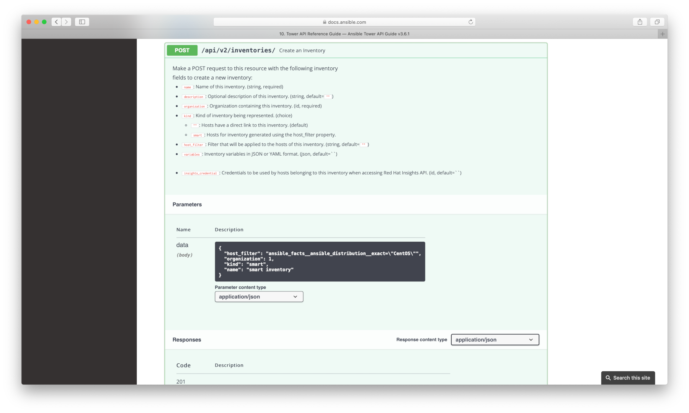

There are 3 available response status code for this resource:

201 - ok  
400 - bad request  
403 - forbidden  

A cURL example:

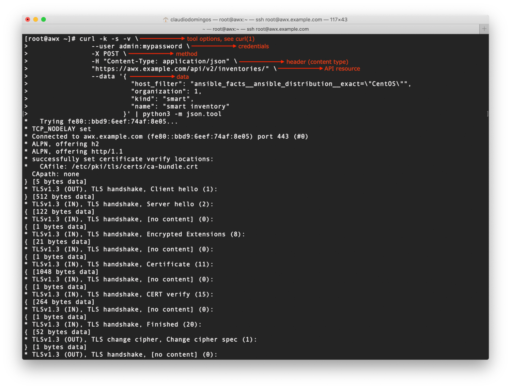
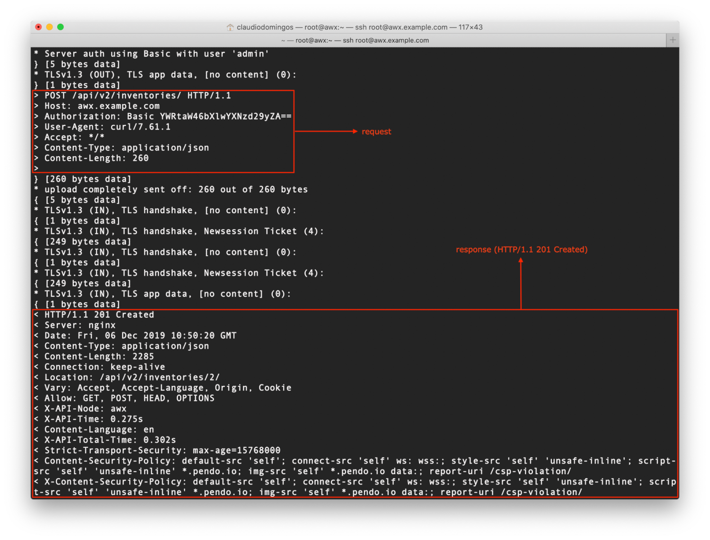

The next topics are hands-on!

### Prerequisites

Before working with API, you need to install some tools.

Install **ansible-tower-cli** using pip3.

```shell
sudo pip3 install ansible-tower-cli
```

Install **perl-JSON-PP** and **jq** packages.

```shell
sudo dnf install -y perl-JSON-PP jq
```

### CLI first steps

The **tower-cli** is the recomended tool to manage Ansible AWX and Tower, but you can use **awx** or **awx-cli** as well, the **awx-cli** will be successor of tower-cli.

Initial **tower-cli** <sup>[2]</sup> configuration.

```shell
tower-cli config
tower-cli config verify_ssl false
tower-cli config host https://awx.example.com
tower-cli config username admin
tower-cli config password mypassword
```

The *tower-cli config* results:

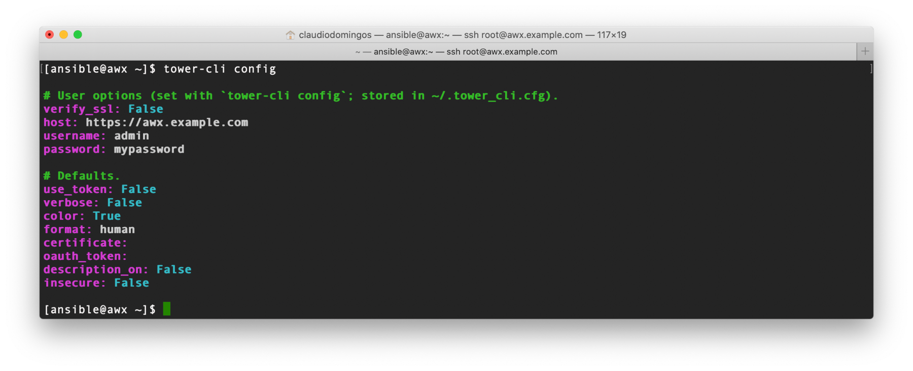

### Creating a static inventory

Create the static inventory.

```shell
tower-cli inventory create \
  --organization "Default" \
  --name "Example Inventory" \
  --variables '{
                  "api_awx_url": "https://awx.example.com",
                  "api_awx_username": "admin",
                  "api_awx_password": "mypassword"
              }'
```

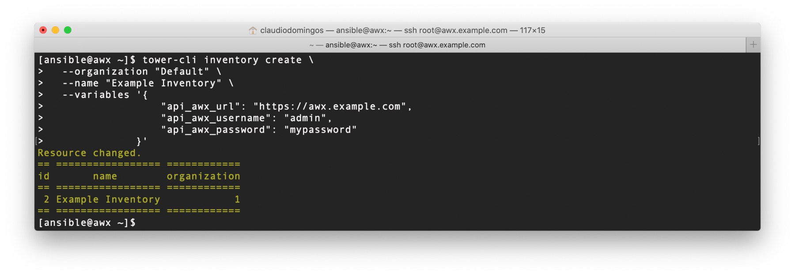

Here is another way to do the same task using curl command (REST API):

```shell
curl -k -s --user admin:mypassword -X POST -H "Content-Type: application/json" \
     "https://awx.example.com/api/v2/inventories/" \
     --data '{
               "name": "Example Inventory",
               "organization": "1",
               "variables": "api_awx_url: \"https://awx.example.com\"\napi_awx_username: admin\napi_awx_password: mypassword"
            }' | python3 -m json.tool
```

Here is another way to do the same task using Web UI:

>Left Menu (Inventories) > click [+] (select Inventory) > fill the form > click [SAVE]
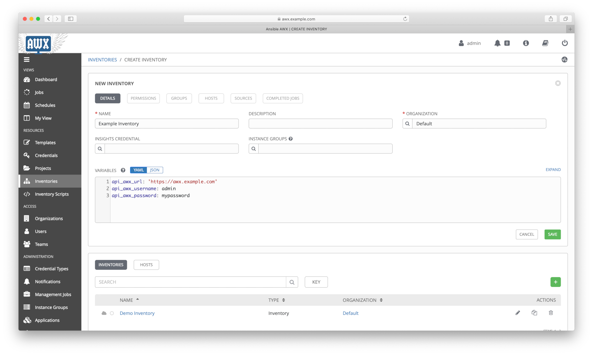

### Adding hosts to the static inventory

Add hosts to the inventory.

```shell
tower-cli host create \
  --name "nodea" \
  --inventory "Example Inventory" \
  --variables 'ansible_host: 172.16.100.151'
```

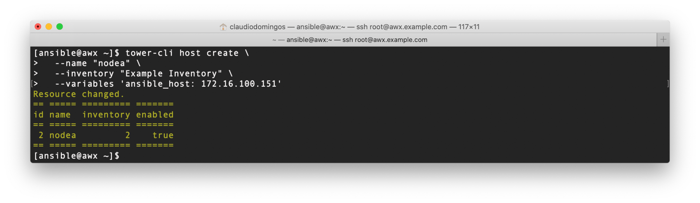

```shell
tower-cli host create \
  --name "nodeb" \
  --inventory "Example Inventory" \
  --variables '{
                 "ansible_host": "172.16.100.152",
                 "api_inventory_disable": "yes"
              }'
```

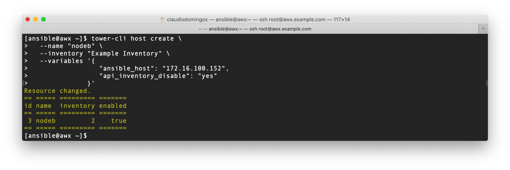

```shell
tower-cli host create \
  --name "nodec" \
  --inventory "Example Inventory" \
  --variables '{
                 "ansible_host": "172.16.100.153",
                 "api_inventory_remove": "yes"
              }'
```

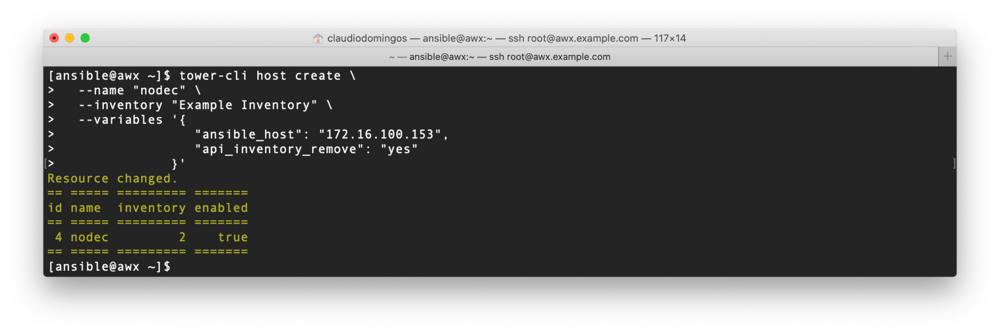

```shell
tower-cli host create \
  --name "noded" \
  --inventory "Example Inventory" \
  --variables '{
                 "ansible_host": "172.16.100.154",
                 "api_inventory_disable": "yes",
                 "api_inventory_remove": "yes"
              }'
```

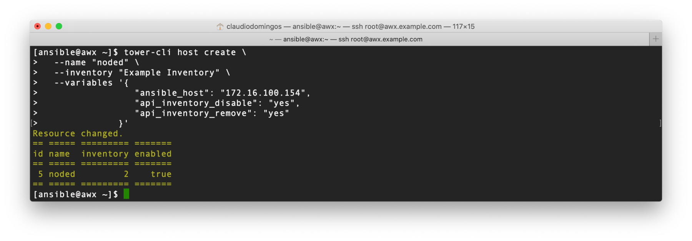

```shell
tower-cli host create \
  --name "nodee" \
  --inventory "Example Inventory"
```

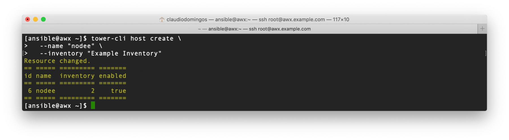

Here is another way to do the same task using curl command (REST API):

```shell
curl -k -s --user admin:mypassword -X POST -H "Content-Type: application/json" \
     "https://awx.example.com/api/v2/inventories/2/hosts/" \
     --data '{
               "name": "nodea",
               "variables": "ansible_host: 172.16.100.151"
            }' | python3 -m json.tool

curl -k -s --user admin:mypassword -X POST -H "Content-Type: application/json" \
     "https://awx.example.com/api/v2/inventories/2/hosts/" \
     --data '{
               "name": "nodeb",
               "variables": "ansible_host: 172.16.100.152\napi_inventory_disable: yes"
            }' | python3 -m json.tool

curl -k -s --user admin:mypassword -X POST -H "Content-Type: application/json" \
     "https://awx.example.com/api/v2/inventories/2/hosts/" \
     --data '{
               "name": "nodec",
               "variables": "ansible_host: 172.16.100.153\napi_inventory_remove: yes"
            }' | python3 -m json.tool

curl -k -s --user admin:mypassword -X POST -H "Content-Type: application/json" \
     "https://awx.example.com/api/v2/inventories/2/hosts/" \
     --data '{
               "name": "noded",
               "variables": "ansible_host: 172.16.100.154\napi_inventory_disable: yes\napi_inventory_remove: yes"
            }' | jq

curl -k -s --user admin:mypassword -X POST -H "Content-Type: application/json" \
     "https://awx.example.com/api/v2/inventories/2/hosts/" \
     --data '{ "name": "nodee" }' | json_pp
```

Here is another way to do the same task using Web UI:

>Left Menu (Inventories) > click (Example Inventory) > click [HOSTS] > click [+] > fill the form > click [SAVE]
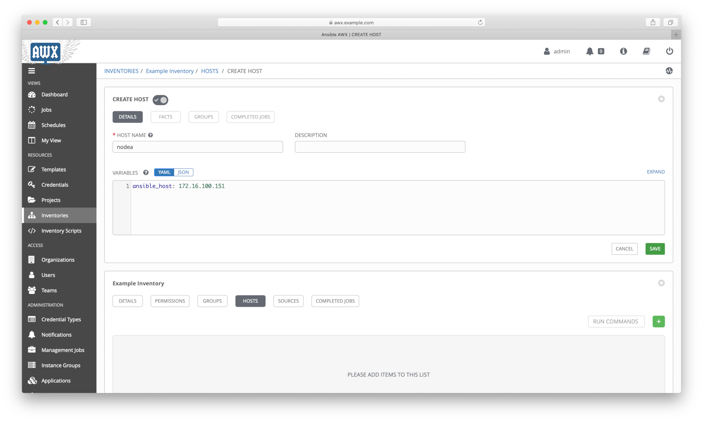

### Identifying inventory by ID

Before make any changes to the static inventory, you'll need to check the inventory id first.

```shell
tower-cli inventory list --organization "Default" --name "Example Inventory"
```

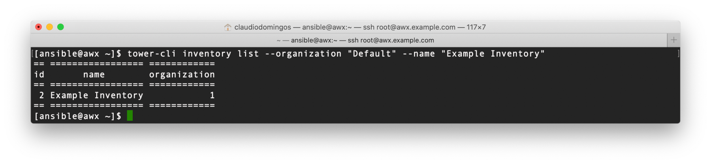

Here is another way to do the same task using curl command (REST API):

```shell
curl -k -s --user admin:mypassword -X GET \
     "https://awx.example.com/api/v2/inventories/?name=Example%20Inventory" | python3 -m json.tool
```

### Identifying host by ID

Now, you'll need to check only enabled hosts.

```shell
tower-cli host list --inventory 2 --enabled true
```

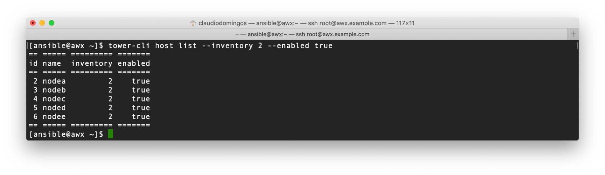

Here is another way to do the same task using curl command (REST API):

```shell
curl -k -s --user admin:mypassword -X GET \
     "https://awx.example.com/api/v2/hosts/?enabled=true&inventory=2" | python3 -m json.tool
```

### Disable host by ID

Once our target host is **"nodee"** having the **"6"** id, you can disable it on inventory.

```shell
tower-cli host modify 6 --enabled false
```

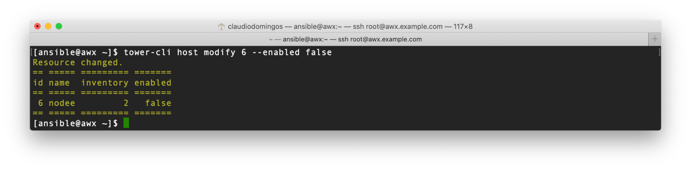

Here is another way to do the same task using curl command (REST API):

```shell
curl -k -s --user admin:mypassword -X PATCH -H "Content-Type: application/json" \
     "https://awx.example.com/api/v2/hosts/6/" \
     --data '{ "enabled": "False" }' | python3 -m json.tool
```

Here is another way to do the same task using Web UI:

>Left Menu (Inventories) > click (Example Inventory) > click [HOSTS] > deselect switch key
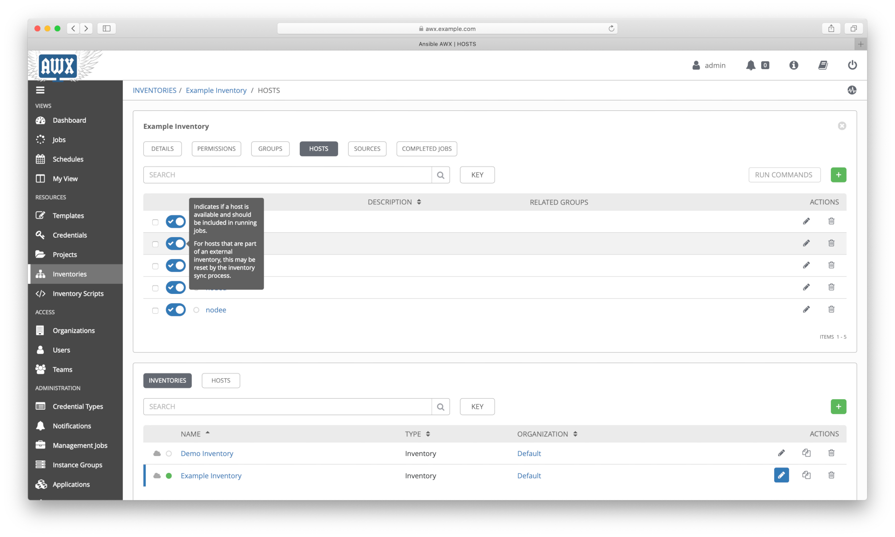

### Delete host by ID

Delete the **"nodee"** from inventory.

```shell
tower-cli host delete 6
```

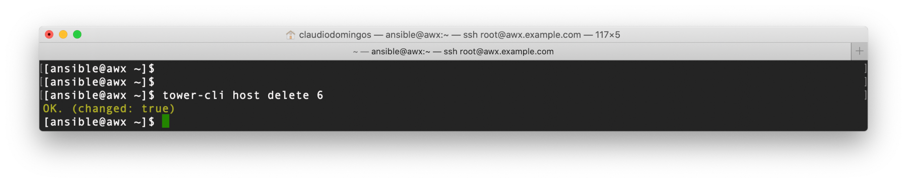

Here is another way to do the same task using curl command (REST API):

NOTE: there are two ways, the first ***curl*** command is recommended.

```shell
curl -k -s --user admin:mypassword -X POST -H "Content-Type: application/json" \
     "https://awx.example.com/api/v2/inventories/2/hosts/" \
     --data '{ "id": 6, "disassociate": "True" }'
```

```shell
curl -k -s --user admin:mypassword -X DELETE "https://awx.example.com/api/v2/hosts/6/"
```

Here is another way to do the same task using Web UI:

>Left Menu (Inventories) > click (Example Inventory) > click [HOSTS] > click [trash icon]
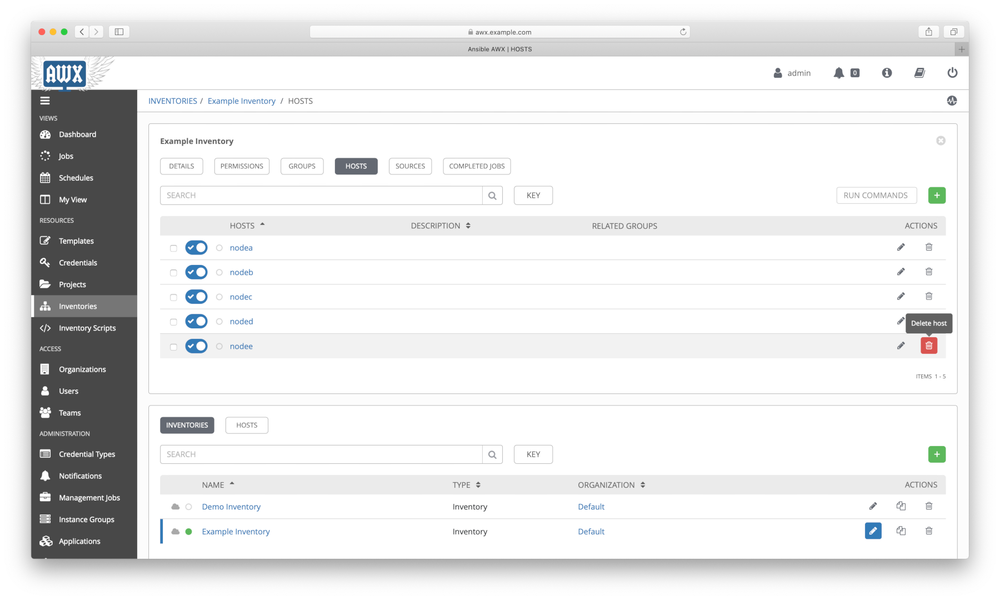

### Summary

In this topic was presented:

- Understanding AWX REST API resources and how to interacts with them;
- Installing  and configuring **tower-cli** tool;
- Working with CLI, REST API and Web UI to manage AWX.

### References

[1]: <https://docs.ansible.com/ansible-tower/latest/html/towerapi/tools.html>
\[1\] - <https://docs.ansible.com/ansible-tower/latest/html/towerapi/tools.html>

[2]: <https://github.com/ansible/tower-cli/tree/master/docs/source/cli_ref/examples>
\[2\] - <https://github.com/ansible/tower-cli/tree/master/docs/source/cli_ref/examples>

## Continue Reading

Next topic: [Playbook to automate AWX REST API interactions](4_playbook.md)

[Go to main page](README.md)

[Go to top](#Managing-AWX-using-REST-API-CLI-and-WEB-UI)
