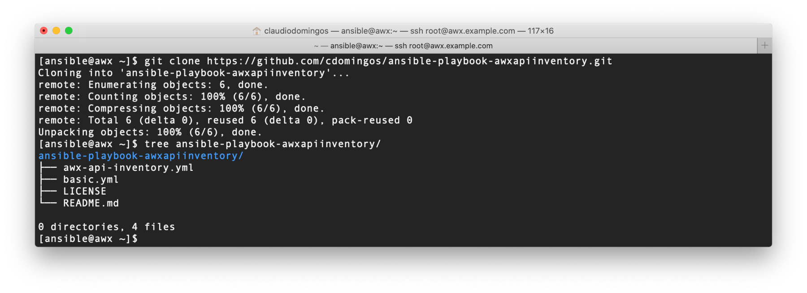

# Ansible AWX Guide: from scratch to REST API (4/8)

## Playbook to automate AWX REST API interactions

This topic is a review of two ansible playbooks.

REST API interactions shown in the previous topic have been converted to playbook, which will be used by Workflow later.

In real envinroment that uses Ansible for configuration management, playbooks are always preferred instead scripts.

## Table of Contents

- [Concepts](#Concepts)
- [Playbook directory structure](#Playbook-directory-structure)
- [The awx-api-inventory playbook](#The-awx-api-inventory-playbook)
- [The basic playbook](#The-basic-playbook)
- [Summary](#Summary)
- [References](#References)

### Concepts

#### What is Ansible Playbook

>Playbooks are Ansible’s configuration, deployment, and orchestration language. They can describe a policy you want your remote systems to enforce, or a set of steps in a general IT process. <sup>[1]</sup>

### Playbook directory structure

Two playbooks has been developed for this guide, see **README.md** for more details at:
<https://github.com/cdomingos/ansible-playbook-awxapiinventory.git>



### The awx-api-inventory playbook

A playbook which interacts with REST API that is able to remove or disable host in inventory.

This playbook uses [**uri**](https://docs.ansible.com/ansible/latest/modules/uri_module.html) ansible module.

```yaml
---
- name: MANAGE HOST IN AWX/TOWER INVENTORY USING REST API
  hosts: all
  connection: local
  gather_facts: false

  vars:
    api_awx_inventory: "{{ awx_inventory_name | default(tower_inventory_name, True) }}"

  tasks:
    - name: Check REST API credentials
      uri:
        url: "{{ api_awx_url | regex_replace('(/+)$') }}/api/v2/me/"
        method: GET
        validate_certs: false
        user: "{{ api_awx_username }}"
        password: "{{ api_awx_password }}"
        return_content: true
        force_basic_auth: true
        status_code: 200

    - name: Get inventory id
      uri:
        url: "{{ api_awx_url | regex_replace('(/+)$') }}/api/v2/inventories/?name={{ api_awx_inventory | urlencode }}"
        method: GET
        validate_certs: false
        user: "{{ api_awx_username }}"
        password: "{{ api_awx_password }}"
        return_content: true
        force_basic_auth: true
        status_code: 200
      register: reg_uri_get_inventory_id
      failed_when: reg_uri_get_inventory_id.json.count == 0

    - name: Set fact_inventory_id
      set_fact:
        fact_inventory_id: "{{ item.id | int }}"
      loop: "{{ reg_uri_get_inventory_id.json.results }}"
      loop_control:
        label: "{{ item.id | int }}"
      when:
        - item.name == api_awx_inventory

    - name: Check if fact_inventory_id is valid
      assert:
        that:
          - fact_inventory_id is defined
          - fact_inventory_id | length > 0

    - name: Check if managed node exists in inventory
      uri:
        url: "{{ api_awx_url | regex_replace('(/+)$') }}/api/v2/inventories/{{ fact_inventory_id }}/hosts/?name={{ inventory_hostname }}"
        method: GET
        validate_certs: false
        user: "{{ api_awx_username }}"
        password: "{{ api_awx_password }}"
        return_content: false
        force_basic_auth: true
      register: reg_uri_host_check

    - when: reg_uri_host_check.json.count > 0
      block:

        # the loop maybe run without arguments when entire block is skipped,
        # this is an elegant way to avoid this behavior
        - name: Set fact_host_id
          set_fact:
            fact_host_id: "{{ item.id | int }}"
          loop: "{{ host_id_loopvar }}"
          loop_control:
            label: "{{ item.id | default('skip', True) }}"
          when:
            - item.name == inventory_hostname
          vars:
            host_id_loopvar: "{{ reg_uri_host_check.json.results | default(['skip'], True) }}"

        - name: Check if fact_host_id is valid
          assert:
            that:
              - fact_host_id is defined
              - fact_host_id | length > 0
              - fact_host_id != "skip"

        - name: Check if managed node id exists
          uri:
            url: "{{ api_awx_url | regex_replace('(/+)$') }}/api/v2/hosts/{{ fact_host_id | int }}/"
            method: GET
            validate_certs: false
            user: "{{ api_awx_username }}"
            password: "{{ api_awx_password }}"
            return_content: true
            force_basic_auth: true
            status_code: 200

        - name: Disable managed node in inventory
          uri:
            url: "{{ api_awx_url | regex_replace('(/+)$') }}/api/v2/hosts/{{ fact_host_id | int }}/"
            method: PATCH
            validate_certs: false
            user: "{{ api_awx_username }}"
            password: "{{ api_awx_password }}"
            return_content: false
            force_basic_auth: true
            status_code: 200
            body:
              enabled: false
            body_format: json
          changed_when: true
          when:
            - api_inventory_disable is defined
            - api_inventory_disable | bool

        - name: Disassociate managed node from inventory
          uri:
            url: "{{ api_awx_url | regex_replace('(/+)$') }}/api/v2/inventories/{{ fact_inventory_id }}/hosts/"
            method: POST
            validate_certs: false
            user: "{{ api_awx_username }}"
            password: "{{ api_awx_password }}"
            return_content: true
            force_basic_auth: true
            status_code: 204
            body: "{'id': {{ fact_host_id | int }}, 'disassociate': true }"
            body_format: json
          register: reg_uri_host_disassociate
          changed_when: true
          when:
            - api_inventory_remove is defined
            - api_inventory_remove | bool

        - name: Check if managed host still exists in inventory
          uri:
            url: "{{ api_awx_url | regex_replace('(/+)$') }}/api/v2/inventories/{{ fact_inventory_id }}/hosts/{{ fact_host_id | int }}/"
            method: GET
            validate_certs: false
            user: "{{ api_awx_username }}"
            password: "{{ api_awx_password }}"
            return_content: false
            force_basic_auth: true
          register: reg_uri_host_checkagain
          failed_when: reg_uri_host_checkagain.status == 200
          when:
            - api_inventory_remove is defined
            - api_inventory_remove | bool
```

This playbook could be rewritten using [**Ansible_Tower**](https://docs.ansible.com/ansible/latest/modules/list_of_web_infrastructure_modules.html#ansible-tower) modules, but I choose the **uri** module to expand API usage.

### The basic playbook

A basic playbook which do simple tasks.

```yaml
---
- name: BASIC TASKS
  hosts: all
  gather_facts: false

  tasks:
    - name: Ensure ansible user exists
      user:
        name: ansible
        state: present

    - name: Test host connectivity
      ping:
```

### Summary

In this topic was presented:

- Review an example playbook to automate API interactions using **uri** ansible module.

### References

[1]: <https://docs.ansible.com/ansible/latest/user_guide/playbooks.html>
\[1\] - <https://docs.ansible.com/ansible/latest/user_guide/playbooks.html>

## Continue Reading

Next topic: [Creating a remote user for Ansible](5_createuser.md)

[Go to main page](README.md)

[Go to top](#Playbook-to-automate-AWX-REST-API-interactions)
