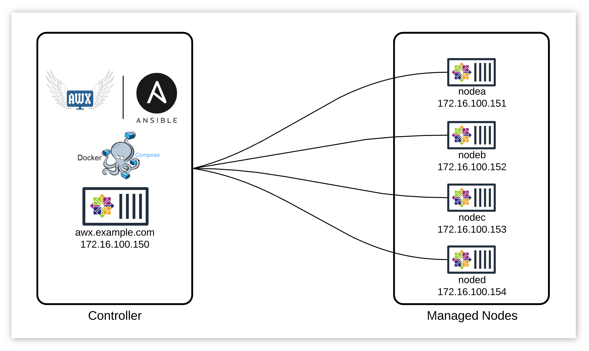
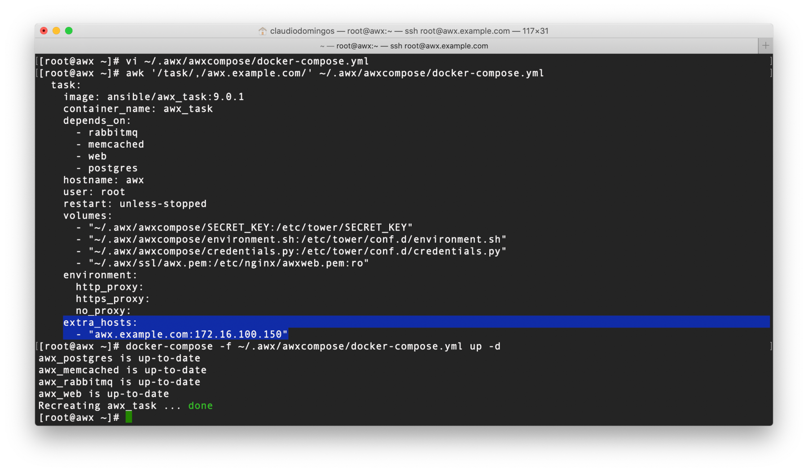
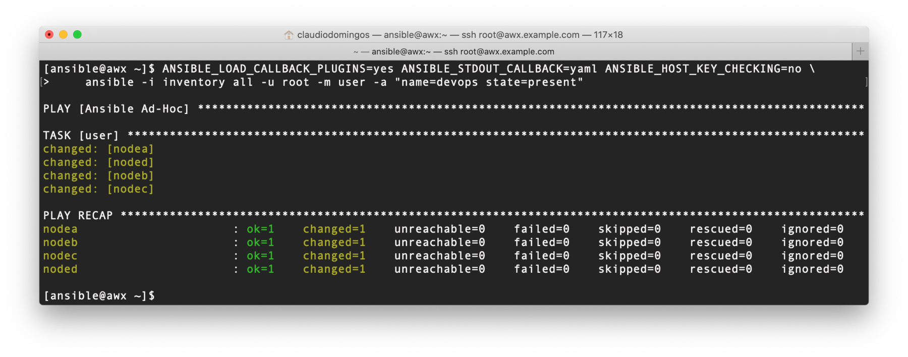
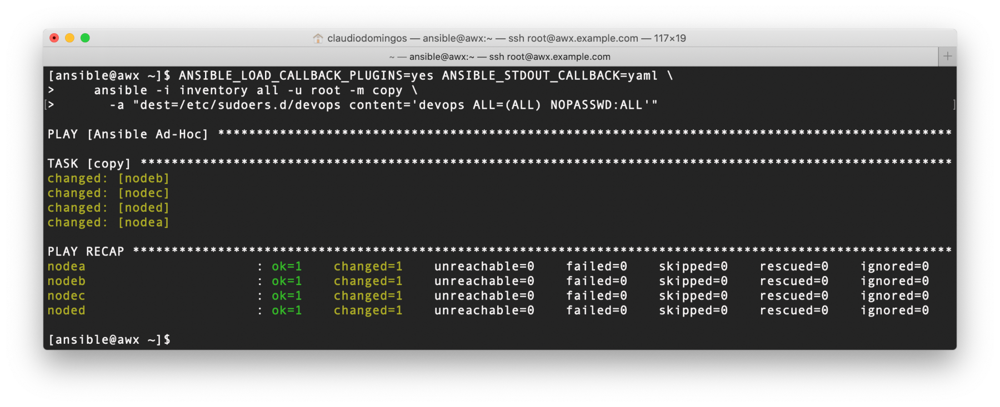
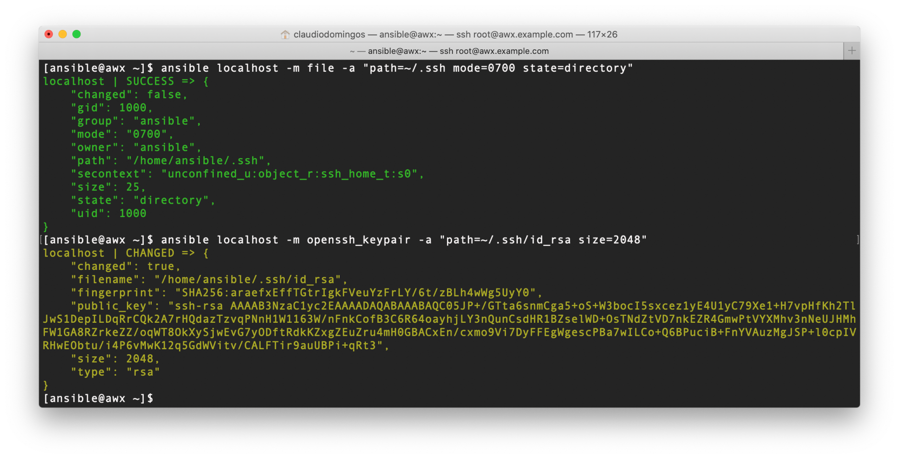
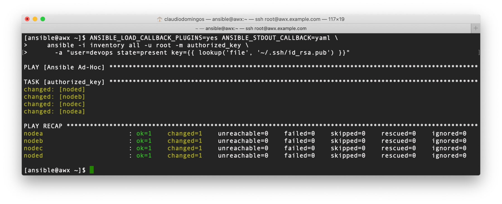
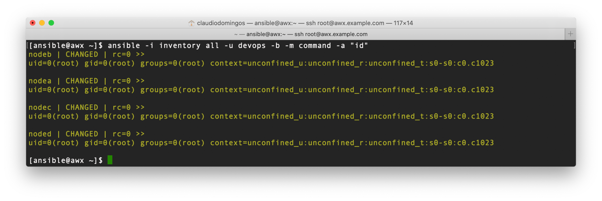

# Ansible AWX Guide: from scratch to REST API (5/8)

## Creating a remote user for Ansible

This topic is about bootstrap an user to be used by Ansible in Managed Nodes.

It is recommended to use a regular user in managed nodes instead root, common user name as ***ansible*** or ***devops*** is not a good idea for production environments.

For a good *traceability* and secure environment compliance, consider using solutions like FreeIPA or Red Hat IDM, each administrator should use their personal accounts.

## Table of Contents

- [Environment](#Environment)
- [Hostname resolution for awx_task container](#Hostname-resolution-for-awx_task-container)
- [Creating a local inventory](#Creating-a-local-inventory)
- [Create the user](#Create-the-user)
- [Create the sudoers file](#Create-the-sudoers-file)
- [Create the OpenSSH keypair](#Create-the-OpenSSH-keypair)
- [Deploy the OpenSSH Public key](#Deploy-the-OpenSSH-Public-key)
- [Check privilege scalation](#Check-privilege-scalation)
- [Summary](#Summary)

### Environment

Use the first topic *"Operating System Installation"* to install the following machines: **nodea**, **nodeb**, **nodec** and **noded**.



NOTE: if you do not want to install the managed nodes, skip all configurations related to "JT - GitHub AWX Basic" that uses basic.yml playbook in AWX Web UI, and got to the next part: [AWX Workflow Use Case](6_workflow.md).

### Hostname resolution for awx_task container

As shown the **awx-api-inventory.yml** playbook have the declared variable `api_awx_url`, as a good practice you should use FQDN instead of IP Address.

If you do not have a DNS previously configured, you can execute the following command:

```shell
sudo docker exec awx_task sh -c "echo 172.16.100.150 awx.example.com >> /etc/hosts"
```

There is a persistent way that you can make changes in your **docker-compose.yml**, adding ***extra_hosts***:

```shell
vi ~/.awx/awxcompose/docker-compose.yml
awk '/task/,/awx.example.com/' ~/.awx/awxcompose/docker-compose.yml
docker-compose -f ~/.awx/awxcompose/docker-compose.yml up -d
```



See [extra_hosts](https://docs.docker.com/compose/compose-file/#extra_hosts) Docker Compose documentation.

### Creating a local inventory

Create a initial inventory.

```shell
cat >> inventory << EOF
nodea ansible_password=centos ansible_host=172.16.100.151
nodeb ansible_password=centos ansible_host=172.16.100.152
nodec ansible_password=centos ansible_host=172.16.100.153
noded ansible_password=centos ansible_host=172.16.100.154
EOF
```

### Create the user

Create **devops** user on managed nodes.

```shell
ANSIBLE_LOAD_CALLBACK_PLUGINS=yes ANSIBLE_STDOUT_CALLBACK=yaml ANSIBLE_HOST_KEY_CHECKING=no \
    ansible -i inventory all -u root -m user -a "name=devops state=present"
```



### Create the sudoers file

Allow **devops** to use passwordless sudo on managed nodes.

```shell
ANSIBLE_LOAD_CALLBACK_PLUGINS=yes ANSIBLE_STDOUT_CALLBACK=yaml \
    ansible -i inventory all -u root -m copy \
      -a "dest=/etc/sudoers.d/devops content='devops ALL=(ALL) NOPASSWD:ALL'"
```



### Create the OpenSSH keypair

Create OpenSSH keypair.

```shell
ansible localhost -m file -a "path=~/.ssh mode=0700 state=directory"
ansible localhost -m openssh_keypair -a "path=~/.ssh/id_rsa size=2048"
```



### Deploy the OpenSSH Public key

Deploy OpenSSH Public key to managed nodes for **devops** user.

```shell
ANSIBLE_LOAD_CALLBACK_PLUGINS=yes ANSIBLE_STDOUT_CALLBACK=yaml \
    ansible -i inventory all -u root -m authorized_key \
      -a "user=devops state=present key={{ lookup('file', '~/.ssh/id_rsa.pub') }}"
```



### Check privilege scalation

Check if **devops** user has privilege escalation permissions.

```shell
ansible -i inventory all -u devops -b -m command -a "id"
```



### Summary

In this topic was presented:

- Create a user in Managed Nodes to be used by Ansible for Controller Node.

## Continue Reading

Next topic: [AWX Workflow Use Case](6_workflow.md)

[Go to main page](README.md)

[Go to top](#Creating-a-remote-user-for-Ansible)
