# Ansible AWX Guide: from scratch to REST API (6/8)

## AWX Workflow Use Case

This topic is about creating an AWX workflow.

## Table of Contents

- [Concepts](#Concepts)
- [Accessing AWX](#Accessing-AWX)
- [Create a machine credential](#Create-a-machine-credential)
- [Create a project](#Create-a-project)
- [Create a job template for basic playbook](#Create-a-job-template-for-basic-playbook)
- [Create a job template for awx-api-inventory playbook](#Create-a-job-template-for-awx-api-inventory-playbook)
- [Create a workflow template](#Create-a-workflow-template)
- [Run workflow](#Run-workflow)
- [Check workflow results](#Check-workflow-results)
- [Check inventory](#Check-inventory)
- [Summary](#Summary)
- [References](#References)

### Concepts

#### What is Workflows

>Workflows allow you to configure a sequence of disparate job templates (or workflow templates) that may or may not share inventory, playbooks, or permissions. However, workflows have ‘admin’ and ‘execute’ permissions, similar to job templates. A workflow accomplishes the task of tracking the full set of jobs that were part of the release process as a single unit. <sup>[1]</sup>

### Accessing AWX

Log in to AWX, in my case **"<https://awx.example.com>"**

Access login page, insert your credentials > click **[SIGN IN]**

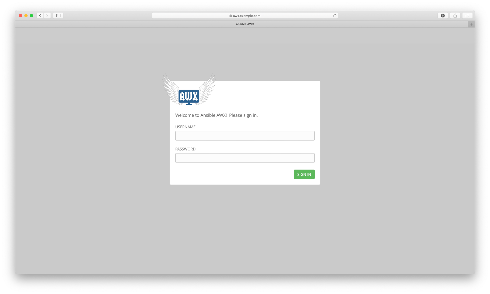

### Create a machine credential

Create the  **"DevOps User"** machine credential.  
Use the OpenSSH Private Key generated by previous topic.

>Left Menu (Credentials) > click \[+] > Fill the form > click [SAVE]
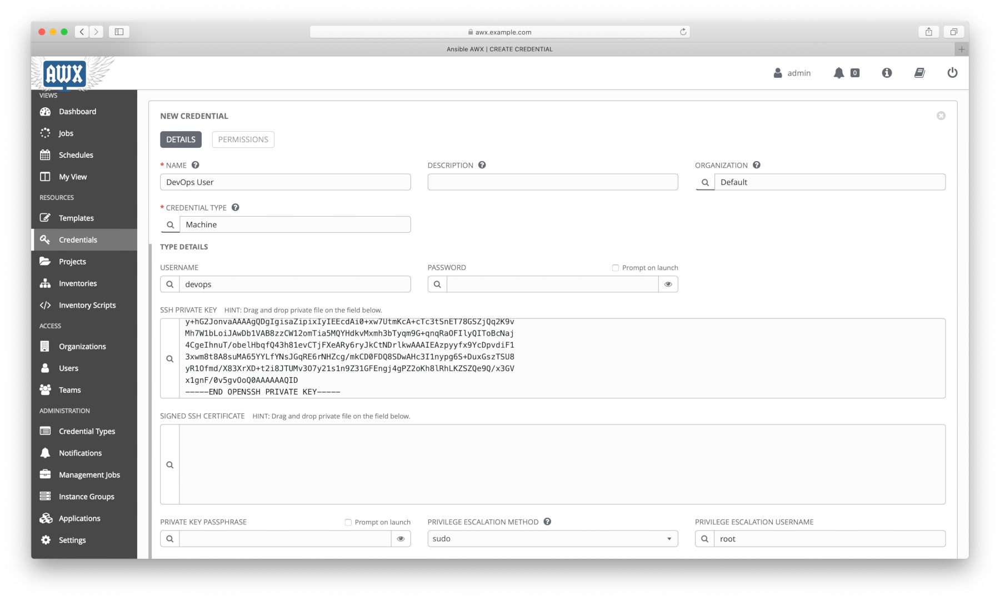

Here is another way to do the same task using *tower-cli*:

```shell
tower-cli credential create --organization "Default" --name "DevOps User" \
  --credential-type "Machine" \
  --inputs "{'username': 'devops', 'ssh_key_data': \"$( sed -z 's/\n/\\n/g' ~/.ssh/id_rsa )\", 'become_method': 'sudo', 'become_username': 'root'}"
```

### Create a project

Create the **"GitHub AWX"** project.  
Use: <https://github.com/cdomingos/ansible-playbook-awxapiinventory.git>

>Left Menu (Projects) > click \[+] > Fill the form > click [SAVE]
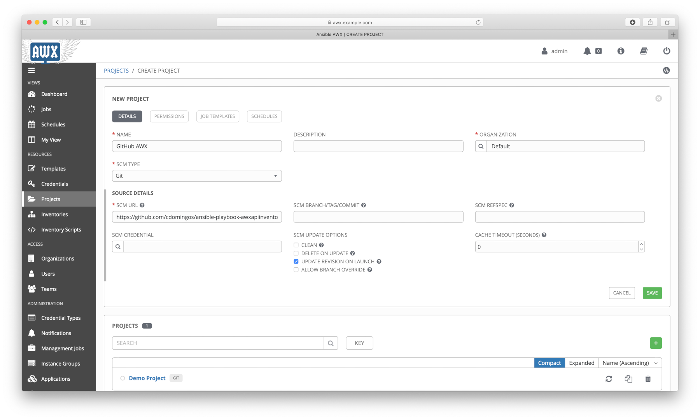

Here is another way to do the same task using *tower-cli*:

```shell
tower-cli project create --organization "Default" --name "GitHub AWX" \
  --scm-type git \
  --scm-url https://github.com/cdomingos/ansible-playbook-awxapiinventory.git \
  --scm-update-on-launch true \
  --wait
```

### Create a job template for ***basic*** playbook

Create the **"JT - GitHub AWX Basic"** job template.

>Left Menu (Templates) > click \[+] (Job Template) > Fill the form > click [SAVE]
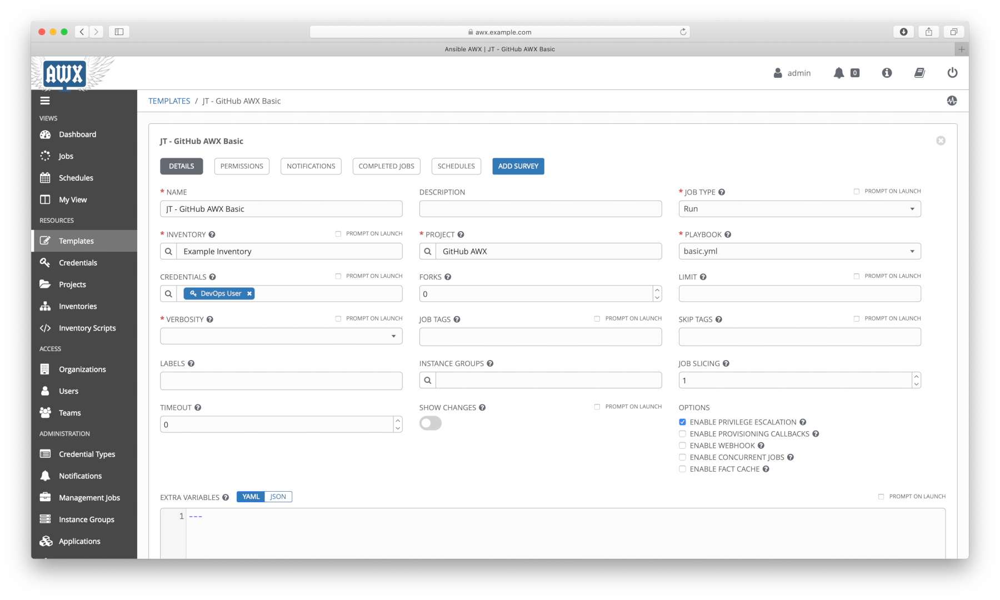

Here is another way to do the same task using *tower-cli*:

```shell
tower-cli job_template create --name="JT - GitHub AWX Basic" --inventory="Example Inventory" \
  --credential="DevOps User" \
  --project="GitHub AWX" --become-enabled true --playbook=basic.yml
```

### Create a job template for ***awx-api-inventory*** playbook

Create the **"JT - GitHub AWX API"** job template.

NOTE: no credentials are required.

>Left Menu (Templates) > click \[+] (Job Template) > Fill the form > click [SAVE]
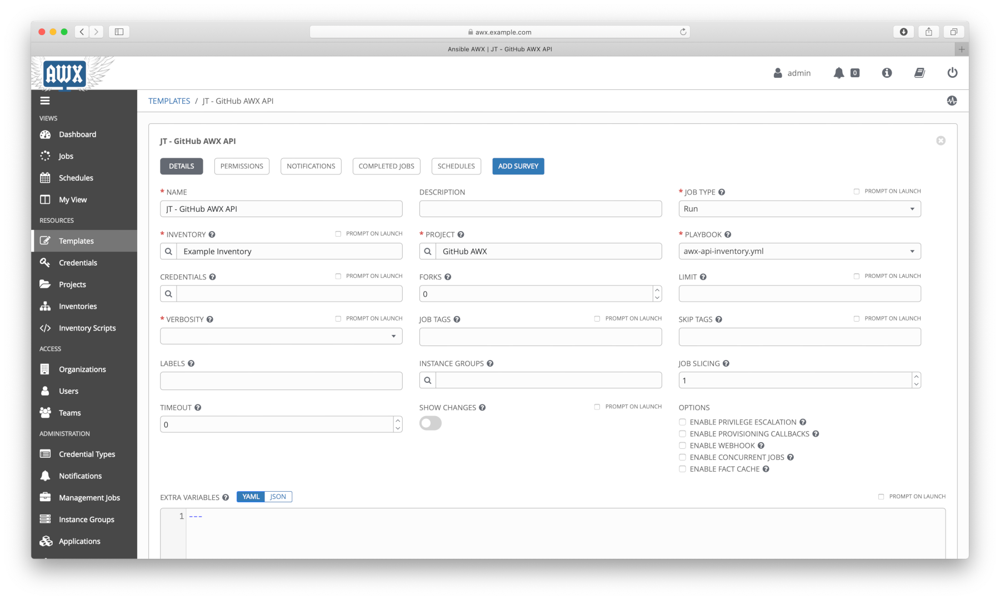

Here is another way to do the same task using *tower-cli*:

```shell
tower-cli job_template create --name="JT - GitHub AWX API" --inventory="Example Inventory" \
    --project="GitHub AWX" --playbook=awx-api-inventory.yml
```

### Create a workflow template

Create the **"WORKFLOW - GitHub AWX"** workflow template.

>Left Menu (Templates) > click \[+] (Workflow Template) > Fill the form > click [SAVE]
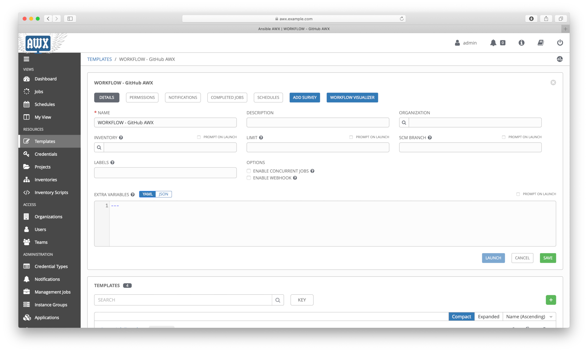
>After [SAVE] will redirect to workflow visualizer > click [START] > Select (JT - GitHub AWX Basic) / RUN: ALWAYS > click [SELECT] > click (+) in (JT - GitHub AWX Basic) > Select (JT - GitHub AWX API) / RUN: On Success > click [SELECT] > click [SAVE]
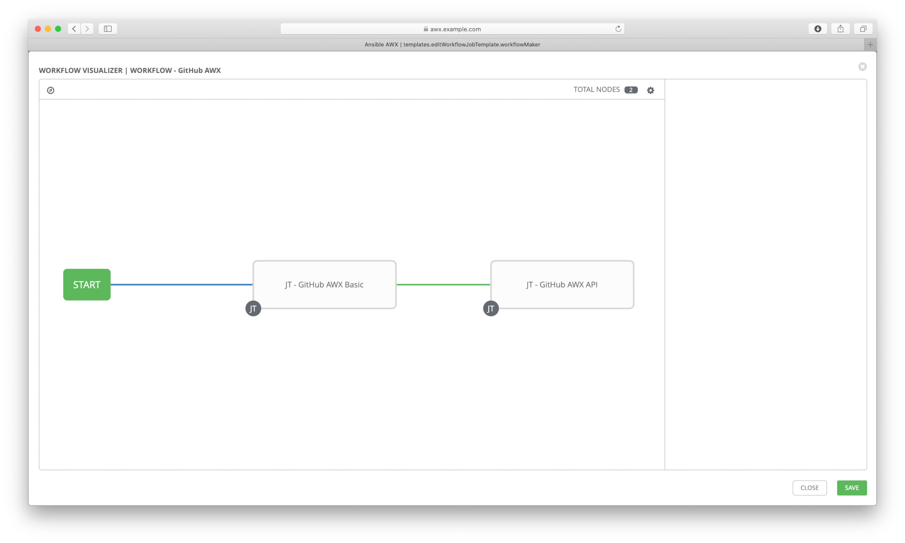

Here is another way to do the same task using *tower-cli* <sup>[2]</sup>:

```shell
tower-cli workflow create --name="WORKFLOW - GitHub AWX"

tower-cli node create --workflow-job-template "WORKFLOW - GitHub AWX" \
  --job-template "JT - GitHub AWX Basic"

tower-cli node create --workflow-job-template "WORKFLOW - GitHub AWX" \
  --job-template "JT - GitHub AWX API"

tower-cli node associate_success_node 1 2
```

### Run workflow

Run the **"WORKFLOW - GitHub AWX"** workflow.

>Left Menu (Templates) > click \[rocket icon] in (WORKFLOW - GitHub AWX)
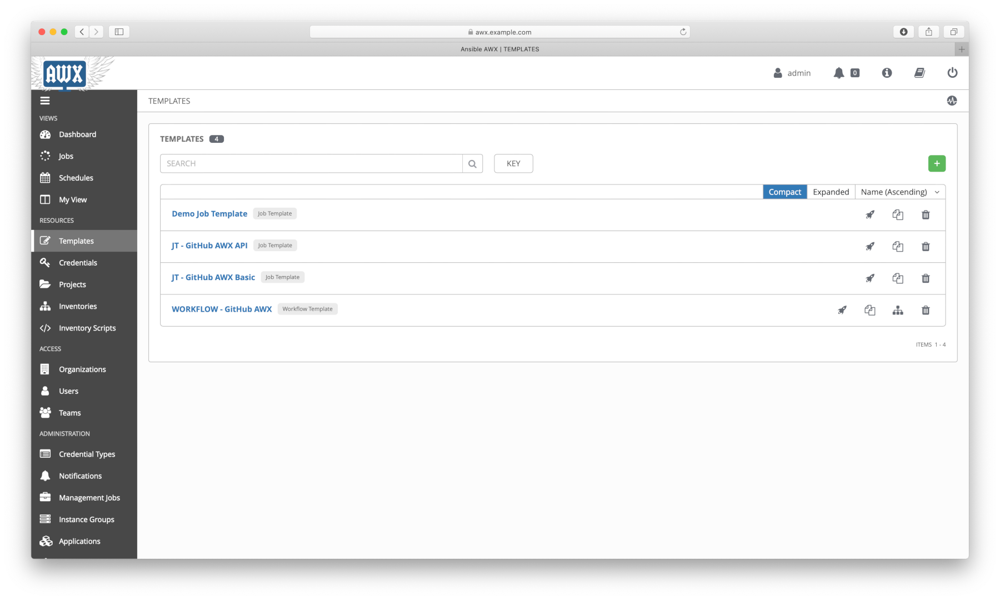

Here is another way to do the same task using *tower-cli*:

```shell
tower-cli workflow_job launch --workflow-job-template "WORKFLOW - GitHub AWX" --monitor
```

### Check workflow results

Check the **"WORKFLOW - GitHub AWX"** workflow and their jobs results.

>Left Menu (Jobs) > click last job for (WORKFLOW - GitHub AWX)
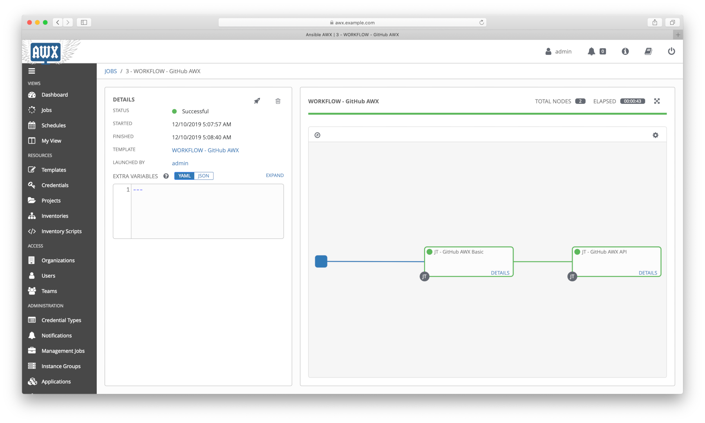
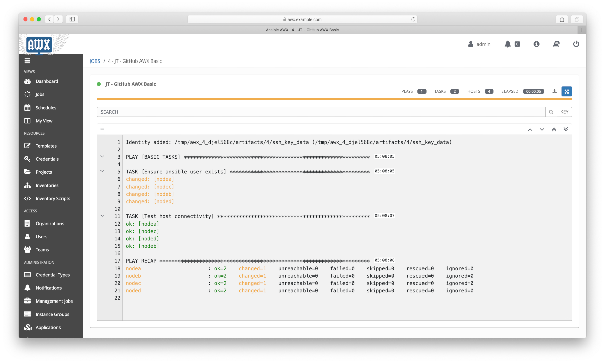
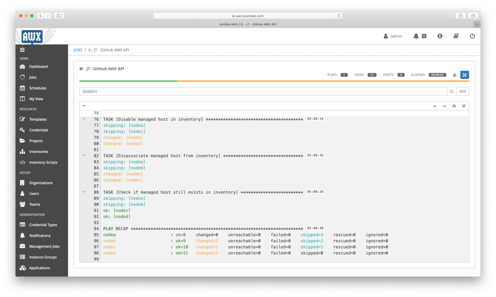

Here is another way to do the same task using *tower-cli*:

```shell
tower-cli job list --job-template "JT - GitHub AWX Basic"

tower-cli job list --job-template "JT - GitHub AWX API"

tower-cli workflow_job list --workflow-job-template "WORKFLOW - GitHub AWX"
```

### Check inventory

Check the **"Example Inventory"** inventory status.

>Left Menu (Inventories) > click (Example Inventory) > click [HOSTS]
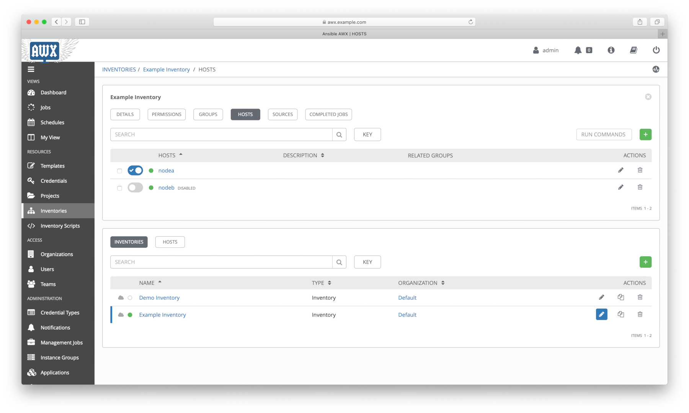

Here is another way to do the same task using *tower-cli*:

```shell
tower-cli host list --inventory "Example Inventory"
```

### Summary

In this topic was presented:

- Working with AWX using Web UI and CLI;
- Create a complete **workflow** in AWX;
- Execute a **workflow** in AWX.

### References

[1]: <https://docs.ansible.com/ansible-tower/latest/html/userguide/workflows.html>
\[1\] - <https://docs.ansible.com/ansible-tower/latest/html/userguide/workflows.html>

[2]: <https://github.com/ansible/tower-cli/blob/master/docs/source/cli_ref/usage/WORKFLOWS.rst>
\[2\] - <https://github.com/ansible/tower-cli/blob/master/docs/source/cli_ref/usage/WORKFLOWS.rst>

## Continue Reading

Next topic: [Protecting data using Ansible Vault](7_vault.md)

[Go to main page](README.md)

[Go to top](#AWX-Workflow-Use-Case)
