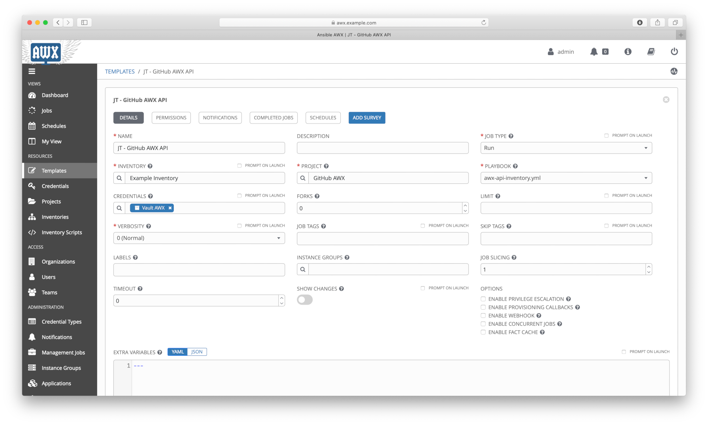

# Ansible AWX Guide: from scratch to REST API (7/8)

## Protecting data using Ansible Vault

This topic is about encrypt sensitive data that are defined as variables in inventory.

Sensitive data such as credentials can be encrypted when used by Playbooks, in real scenario the Ansible AWX or Red Hat Ansible Tower have many users accessing playbooks, inventories, variables, etc.

Ansible Vault is the official tool to encrypt any sensitive data used by Ansible.

## Table of Contents

- [Concepts](#Concepts)
- [Create a vault credential](#Create-a-vault-credential)
- [Encrypt sensitive data using ansible-vault](#Encrypt-sensitive-data-using-ansible-vault)
- [Adjust inventory](#Adjust-inventory)
- [Adjust job template](#Adjust-job-template)
- [Run workflow](#Run-workflow)
- [Check workflow results](#Check-workflow-results)
- [Summary](#Summary)
- [References](#References)

### Concepts

#### What is Ansible Vault

>Ansible Vault is a feature of ansible that allows you to keep sensitive data such as passwords or keys in encrypted files, rather than as plaintext in playbooks or roles. These vault files can then be distributed or placed in source control. <sup>[1]</sup>

### Create a vault credential

Create the **"Vault AWX"** vault credential.

>Left Menu (Credentials) > click \[+] > Fill the form > click [SAVE]


Here is another way to do the same task using *tower-cli*:

```shell
tower-cli credential create --organization "Default" --name="Vault AWX" --credential-type="Vault" \
  --inputs='{"vault_password": "myvaultpass"}'
```

### Encrypt sensitive data using ansible-vault

For requested *"New Vault password:"* use ***myvaultpass*** according previous task.

```shell
ansible-vault encrypt_string "admin" --name "api_awx_username"
```


```shell
ansible-vault encrypt_string "mypassword" --name "api_awx_password"
```


### Adjust inventory

Adjust the **"Example Inventory"** inventory.

NOTE: before copying results, convert it to the following format:

#### ***Before***

```yaml
api_awx_username: !vault |
          $ANSIBLE_VAULT;1.1;AES256
          64313237613433336139303839353030356336346236333139336331373462303335326662376665
...output omitted...
```

#### *After*

```yaml
api_awx_username:
  __ansible_vault: |
          $ANSIBLE_VAULT;1.1;AES256
          64313237613433336139303839353030356336346236333139336331373462303335326662376665
...output omitted...
```

Repeat the process for `api_awx_password` variable.

>Left Menu (Inventories) > click (Example Inventory) > Edit VARIABLES > click [SAVE]


Here is another way to do the same task using *tower-cli*:


```shell
tower-cli inventory modify --organization "Default" --name "Example Inventory" \
  --variables @vault.yml
```

### Adjust job template

Adjust the **"JT - GitHub AWX API"** job template adding the **"Vault AWX"** vault credential.

>Left Menu (Templates) > click (JT - GitHub AWX API) > Search CREDENTIALS / CREDENTIALS TYPE: Vault (Vault AWX) > click [SAVE]


Here is another way to do the same task using *tower-cli*:

```shell
tower-cli job_template modify --name "JT - GitHub AWX API" --credential "Vault AWX"
```

### Run workflow

Run the **"WORKFLOW - GitHub AWX"** workflow.

>Left Menu (Templates) > click \[rocket icon] in (WORKFLOW - GitHub AWX)


Here is another way to do the same task using *tower-cli*:

```shell
tower-cli workflow_job launch --workflow-job-template "WORKFLOW - GitHub AWX" --monitor
```

### Check workflow results

Check the **"WORKFLOW - GitHub AWX"** workflow and their jobs results.

>Left Menu (Jobs) > click last job for (WORKFLOW - GitHub AWX)


Here is another way to do the same task using *tower-cli*:

```shell
tower-cli job list --job-template "JT - GitHub AWX Basic"

tower-cli job list --job-template "JT - GitHub AWX API"

tower-cli workflow_job list --workflow-job-template "WORKFLOW - GitHub AWX"
```

### Summary

In this topic was presented:

- Working with AWX using Web UI and CLI;
- Encrypt sensitive data using **ansible-vault**;
- Adjust AWX Job Template to decrypt this data using a **Vault Credential**.

### References

[1]: <https://docs.ansible.com/ansible/latest/user_guide/vault.html>
\[1\] - <https://docs.ansible.com/ansible/latest/user_guide/vault.html>

## Continue Reading

Next topic: [What's Next](8_whatsnext.md)

[Go to main page](README.md)

[Go to top](#Protecting-data-using-Ansible-Vault)
